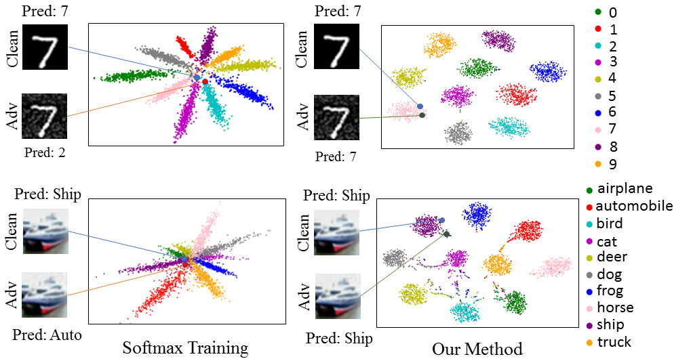
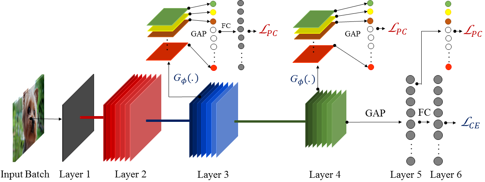

# Adversarial Defense by Restricting the Hidden Space of Deep Neural Networks (ICCV'19)



This repository is an PyTorch implementation of the ICCV'19 paper [Adversarial Defense by Restricting the Hidden Space of Deep Neural Networks](https://arxiv.org/abs/1904.00887).

To counter adversarial attacks, we propose Prototype Conformity Loss to class-wise disentangle intermediate features of a deep network. From the figure, it can be observed that the main reason for the existence of such adversarial samples is the close proximity of learnt features in the latent feature space.

We provide scripts for reproducing the results from our paper.


## Clone the repository
Clone this repository into any place you want.
```bash
git clone https://github.com/aamir-mustafa/pcl-adversarial-defense
cd pcl-adversarial-defense
```
## Softmax (Cross-Entropy) Training
To expedite the process of forming clusters for our proposed loss, we initially train the model using cross-entropy loss.
 
``softmax_training.py`` -- ( For initial softmax training).

* The trained checkpoints will be saved in ``Models_Softmax`` folder.


## Prototype Conformity Loss
The deep features for the prototype conformity loss are extracted from different intermediate layers using auxiliary branches, which map the features to a lower dimensional output as shown in the following figure.




``pcl_training.py`` -- ( Joint supervision with cross-entropy and our loss).

* The trained checkpoints will be saved in ``Models_PCL`` folder.

## Adversarial Training
``pcl_training_adversarial_fgsm.py`` -- ( Adversarial Training using FGSM Attack).

``pcl_training_adversarial_pgd.py`` -- ( Adversarial Training using PGD Attack).


## Testing Model's Robustness against White-Box Attacks

``robustness.py`` -- (Evaluate trained model's robustness against various types of attacks).

## Comparison of Softmax Trained Model and Our Model
Retained classification accuracy of the model's under various types of adversarial attacks:

| Training Scheme |  No Attack  |  FGSM  |   BIM   |   MIM   |   PGD   |
| :-------        | :---------- | :----- |:------  |:------  |:------  |
|     Softmax     |    92.15    |  21.48 |   0.01  |   0.02  |   0.00  |
|      Ours       |    89.55    |  55.76 |  39.75  |  36.44  |  31.10  |


## Citation
```
@InProceedings{Mustafa_2019_ICCV,
author = {Mustafa, Aamir and Khan, Salman and Hayat, Munawar and Goecke, Roland and Shen, Jianbing and Shao, Ling},
title = {Adversarial Defense by Restricting the Hidden Space of Deep Neural Networks},
booktitle = {The IEEE International Conference on Computer Vision (ICCV)},
month = {October},
year = {2019}
}
```

